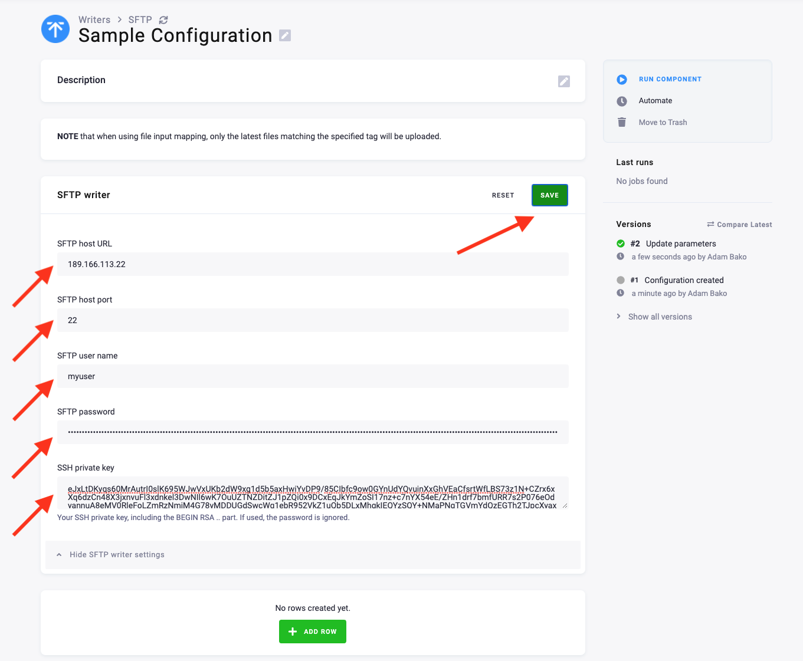
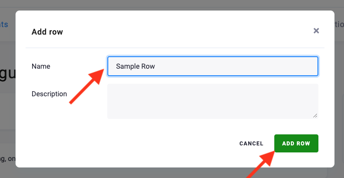
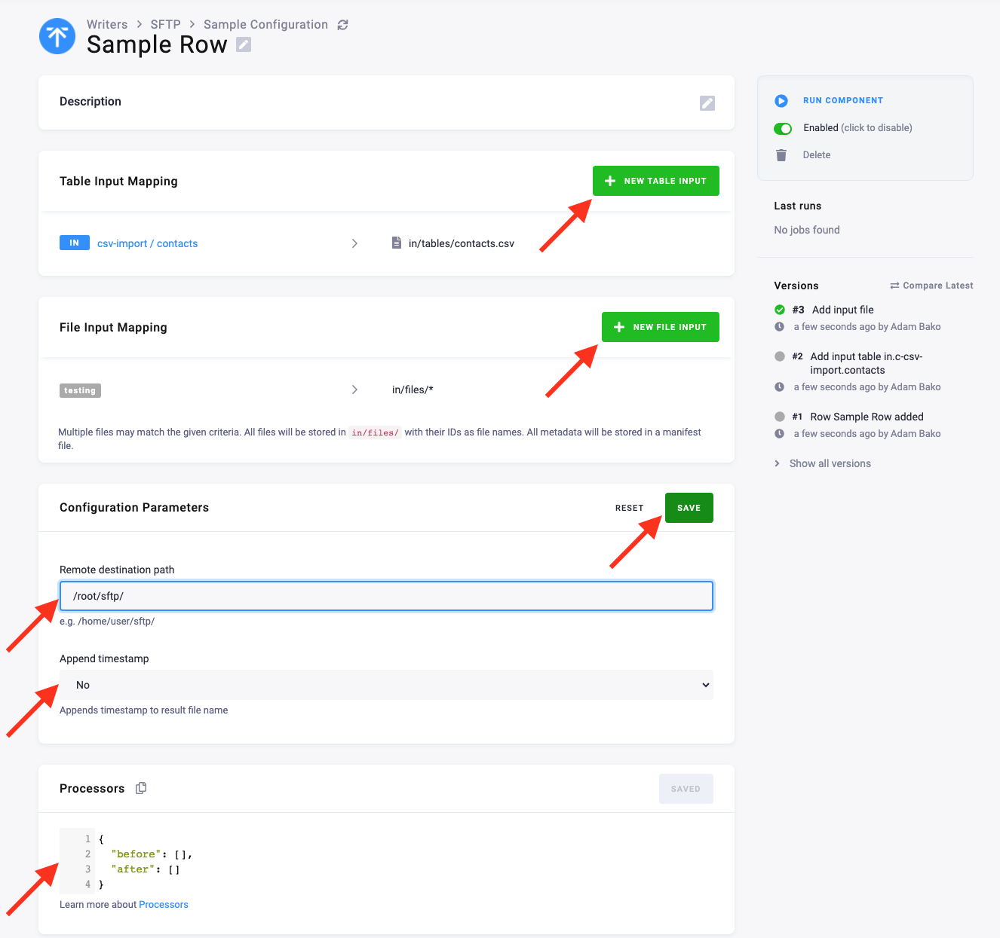

* TOC
{:toc}
  

This writer allows you to write tables and files to a remote SFTP server.

## Configuration

[Create a new configuration](https://help.keboola.com/components/#creating-component-configuration) 
of the SFTP writer. 
In the next step, provide the target SFTP server URL, port (default is 22), and authentication, either via 
username and password or with a private key.

{: .image-popup}
 

__Save__ the SFTP parameters and continue to the 
[configuration rows](https://help.keboola.com/components/#configuration-rows) by clicking the 
Add Row button which will prompt you to create a new row configuration

{: .image-popup}
 

__Add__ the new row and fill in the [tables](https://help.keboola.com/transformations/mappings/#table-input-mapping) 
and [files](https://help.keboola.com/transformations/mappings/#file-input-mapping) you want to write to the SFTP server.
Add new tables with the New Table Input button. Once added the tables will show up in the Table Input Mapping.
Add new files with the New File Input button, you can add files using 
[file tags](https://help.keboola.com/transformations/mappings/#file-input-mapping).

Next configure the parameters by adding the remote destination path in the SFTP server. 
Make sure the remote destination path exists on the server.

Next configure the append timestamp parameter, this will append the current timestamp to the filename. 
If you are uploading the same tables and want to have historical
records this would be your solution.

When these parameters are set, press the save button to save the configuration

If you want to add [processors](https://developers.keboola.com/extend/component/processors/) 
to the files or tables before the input you can specify these in the processor configuration window.

{: .image-popup}
 

