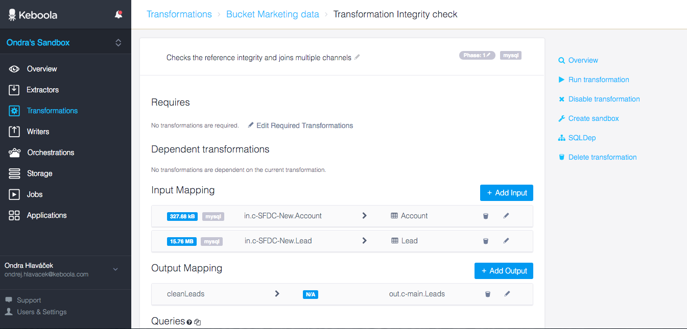

* TOC
{:toc}

*See how Transformations are an integral part of the KBC workflow in our [Getting Started tutorial](/overview/tutorial/manipulate/).*

**Transformations** allow you to manipulate data in your project. They are the tasks you want to perform. *Marketing data preaggregation*, 
*Tableau denormalizer*, *Integrity checker* or *Join marketing channels and sales*, to name a few.
They are grouped into folders called **Transformation buckets**. Each transformation within a bucket can use a different backend 
to perform the task with the most suitable tool and programming language. As some tasks are difficult to solve in SQL, 
feel free to step in with Python and finish the work with SQL again. The following are the currently available backends:

 - SQL
   - [MySQL](./mysql/)
   - [Redshift](./redshift/)
   - [Snowflake](./snowflake/)
 - Script
   - [R](./r/)
   - [Python](./python/)

## Backends

How to decide which backend is appropriate for each task? A rule of thumb is that SQL performs better for joining tables, filtering data,
grouping and simple aggregations. Script languages are more suitable for processing one line at a time, raw data processing or 
custom analytical tasks.

### SQL

Choosing between [MySQL](./mysql/), [Redshift](./redshift/) and [Snowflake](./snowflake/) can be a matter of your preference or 
the overall performance. Many projects start with MySQL and as they grow, they are switched to Redshift on a dedicated cluster. 
That unfortunately requires rewriting the SQL code.

### Script

[Python](./python/) or [R](./r/)? Choose according to your taste and available libraries.

## Mappings

To make sure your SQL code or script does not harm the source tables, the input and output mapping separates the source data from your transformation. 
Each transformation has a secure workspace with copied data from the tables specified in the input mappings. 
After the transformation has executed successfully, only tables/files defined in the output mappings are brought back to Storage. 
Any other artifacts, such as temporary tables or files, are deleted permanently from the transformation workspace when the execution finishes.

{: .image-popup}

### Input Mapping

The input mapping defines data you have in Storage and want to use in a transformation. This data will be made available as a table for SQL, or as a CSV file for R and Python.

{: .image-popup}

Any input mapping has the following options:

- **Source** -- Identify a table in Storage
- **File name**/**Destination** - A destination file name for your script, or a table name for your SQL; file names should end with `.csv`
- **Columns** -- Select specific columns if you do not want to import them all; this saves processing time for larger tables
- **Days** -- If you are into incremental processing, this comes in handy; import only rows changed during a given number of days (`0` downloads all)
- **Data filter** -- Download only rows that will match this single column multiple values filter

You can combine these options freely. Input mappings for Snowflake, MySQL and Redshift include more options specific to the particular backend:

- **Data types** (MySQL, Redshift, Snowflake) -- Data type for each column (Redshift allows to set a [column compression type](http://docs.aws.amazon.com/redshift/latest/dg/t_Compressing_data_on_disk.html) as well)
- **Indexes** (MySQL) -- Create indexes on the destination table
- **Sort key** (Redshift) -- Table [sort key](http://docs.aws.amazon.com/redshift/latest/dg/t_Sorting_data.html)
- **Dist key** (Redshift) -- Table [distribution key](http://docs.aws.amazon.com/redshift/latest/dg/t_Distributing_data.html) and  [distribution style](http://docs.aws.amazon.com/redshift/latest/dg/c_choosing_dist_sort.html)
- **COPY options** (Redshift) -- Specifies options for the Redshift [COPY command](http://docs.aws.amazon.com/redshift/latest/dg/r_COPY.html)

### Output Mapping

The output mapping takes results (tables and files) from your transformation and stores them back in Storage. It can create, overwrite, and append any table. 
These tables are typically derived from the tables/files in the Input mapping. In SQL transformations, 
you can use any `CREATE TABLE`, `CREATE VIEW`, `INSERT`, `UPDATE` or `DELETE` queries to create the desired result.

{: .image-popup}

An output mapping has the following options:

- **Source** -- Either a table name in the transformation database or a file name (including `.csv`)
- **Destination** -- Identify a table in Storage
- **Incremental** -- If the destination table already exists, it is not overwritten, but resulting data are appended to it. 
- **Primary key** -- The primary key of the destination table; if the table already exists, the primary key must match. Feel free to use a multi-column primary key.
- **Delete rows** -- Delete rows matching the criteria from the destination table before importing the data

## Versions

Each change in the transformation configuration creates a new version of the whole bucket configuration. 
You can easily access previous versions of all transformations in a bucket and see what has changed.

## Developing transformations

You can easily develop MySQL and Redshift transformations using [Sandbox](/manipulation/transformations/sandbox). 
We provide you with a safe workspace with required data where you can play with your SQL code.

## Advanced Features

### Phases

Phases allow you to run multiple transformation steps within a single workspace, for example, a single MySQL database. 
If multiple steps use the same input mapping (they share data), it might save a bit of processing time, but, ultimately, it makes everything less clear and isolated. 
To save time, you can run multiple orchestration tasks in parallel.

### Dependencies

Dependencies allow you to chain transformation steps. A given transformation is executed after all required steps have been executed. 

Originally, we thought this was a cool idea; it allowed everyone to build a network of interdependent and reusable blocks of SQL code. However, a network of nontransparent dependency trees was usually created, so we have decided to abolish this feature in the near future. If possible, please do not use dependencies as it will make future migrations easier.