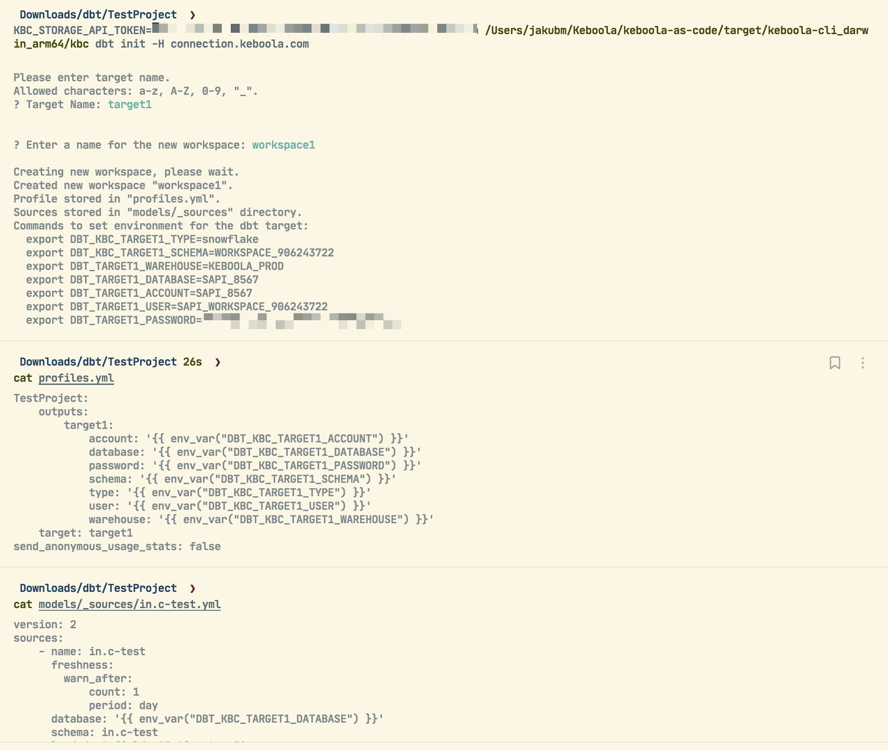
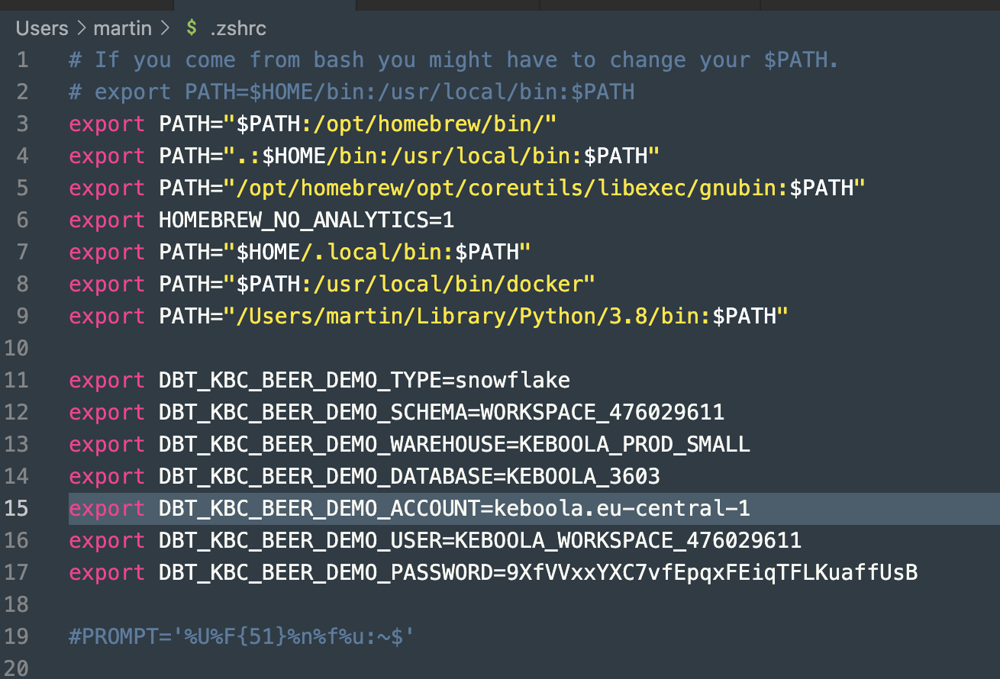
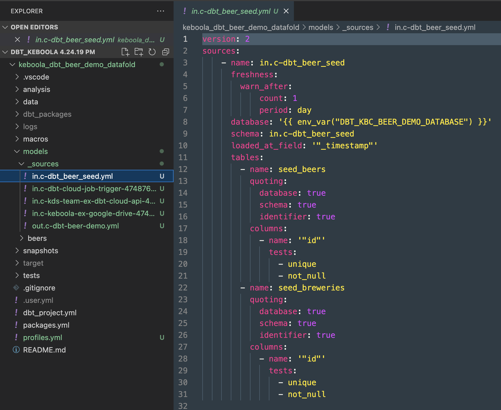
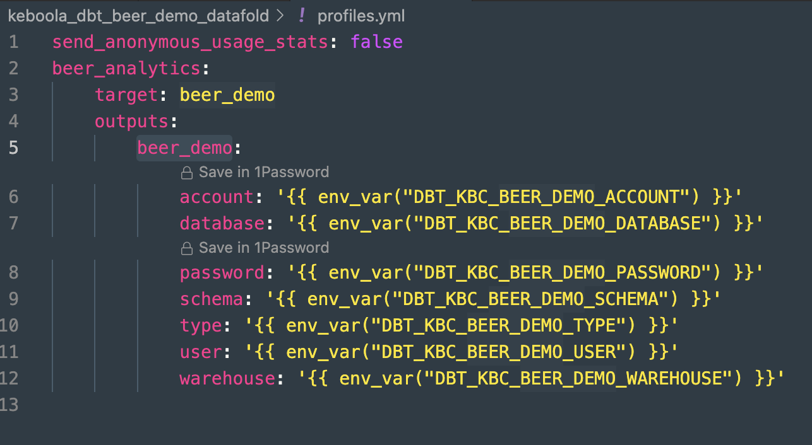
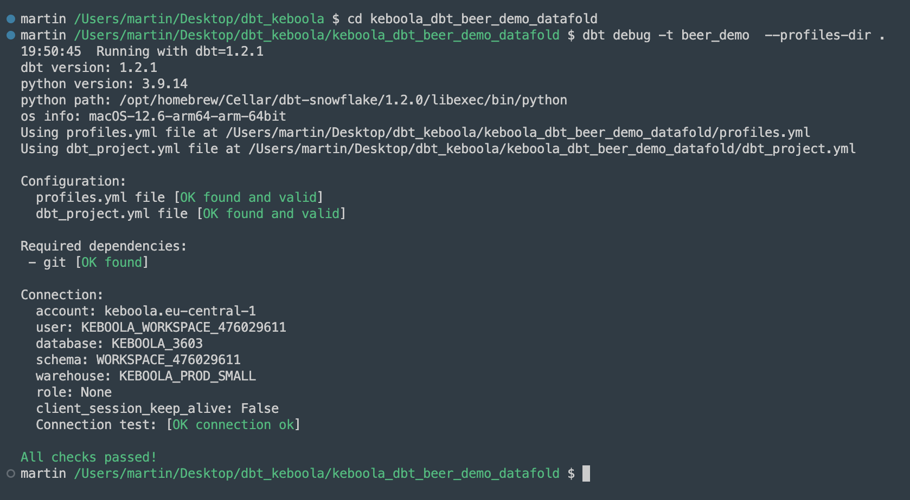
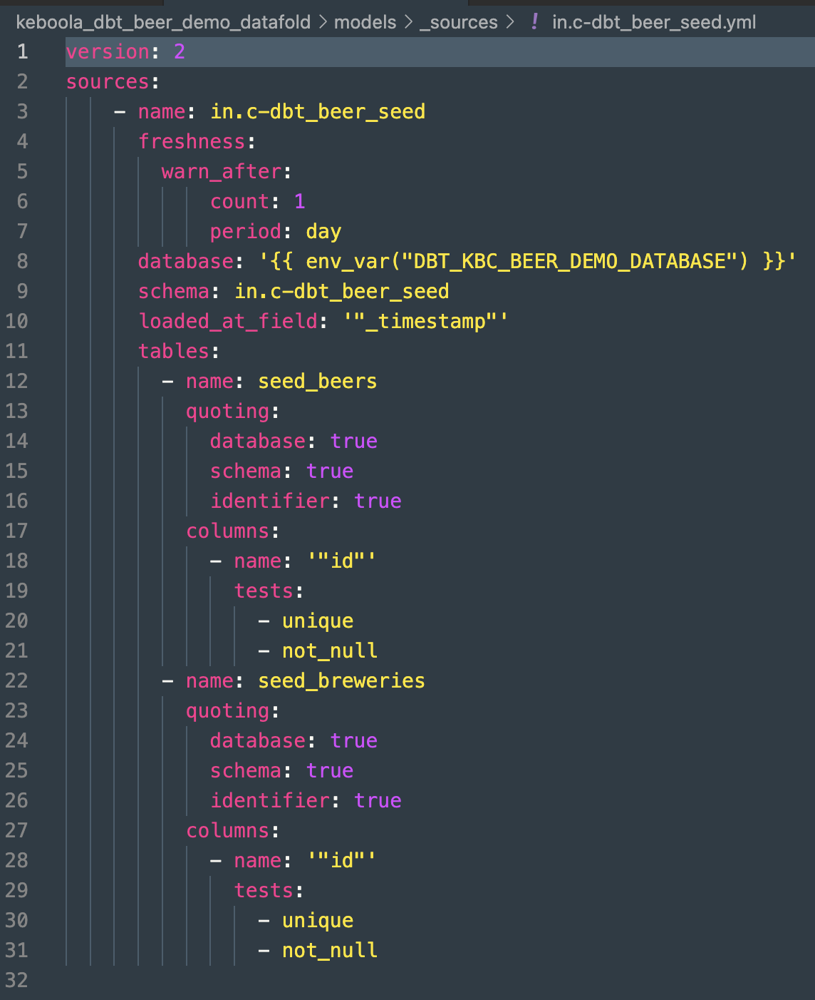
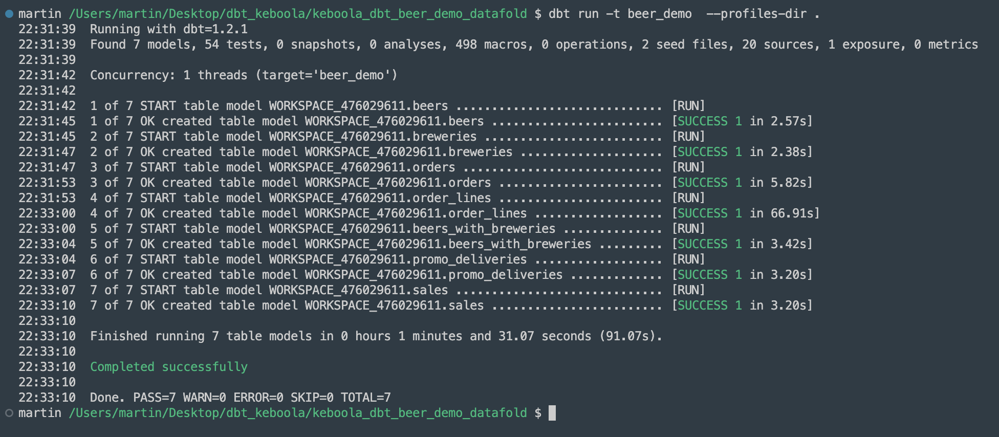
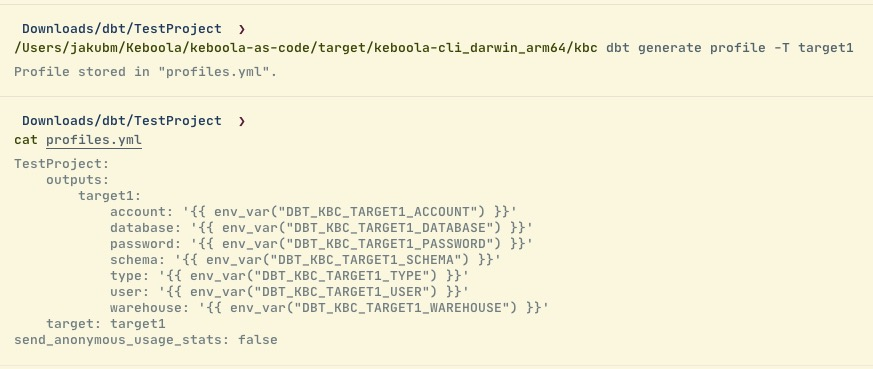
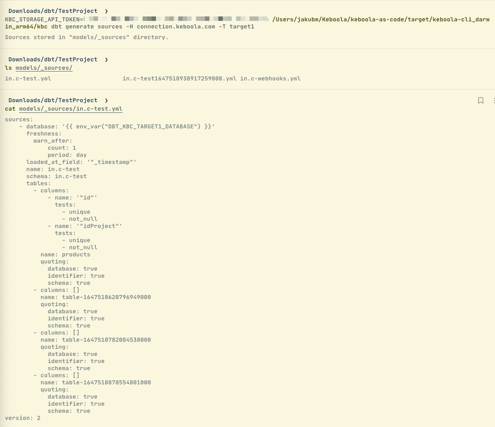

Video:
<iframe width="560" height="315" src="https://www.youtube.com/embed/q3wZ8gukpnw" title="YouTube video player" frameborder="0" allow="accelerometer; autoplay; clipboard-write; encrypted-media; gyroscope; picture-in-picture" allowfullscreen></iframe>

## Local Development

Let's set up the local development with [Keboola CLI](https://developers.keboola.com/cli/).

It is easy on Mac with [homebrew](https://docs.brew.sh/Installation.html) support (other platforms covered in the [documentation](https://developers.keboola.com/cli/installation/)):

```java
brew tap keboola/keboola-cli
brew install keboola-cli
kbc --version
```

If you already have CLI, just make sure you have the most updated version:

```java
brew upgrade keboola-cli
kbc --version
```

{: width="100%" }

**You will have then the access to dbt-related commands within kbc CLI!**

### Steps

**initial setup**

The user has a KBC project, cloned git repository with a dbt project and the dbt binary installed.

The user is in the folder with the cloned dbt project and can run the following commands.

`kbc dbt init`
--------------

1.  Creates Snowflake workspace.

2.  Generates `profiles` and `sources` yaml files.

    1.  `DBT_KBC_DEV_{ENV_NAME}_DATABASE` (we ask for env name)

3.  Generates env vars (used `profiles.yml`).

4.  They are outputted to stdout.


### Example

{: width="100%" }

Store credentials to your zsh env profile (or your respective environment):
---------------------------------------------------------------------------

File is located (Unix) in `~/.zshrc`

{: width="100%" }

User is then able to run dbt locally against project storage, safely develop and test code

As a part of init command, CLI will create all sources from the storage buckets. A storage bucket = source file with tables within:

{: width="100%" }

Please note that `_timestamp` is automatically filled, alongside of `primary keys` and corresponding `tests` for primary keys (`unique` and `not_null` tests).

### Run test debug

```java
dbt debug -t beer_demo --profiles-dir .
```

**Notes**

*   `beer_demo` is the target name used in prior step and visible in the profiles.yml


*   We are using local profiles, those are using environmental variables stored before.


{: width="100%" }

User should see green in all steps:

{: width="100%" }

dbt Run
-------

For the script alteration, the only check/change user has to make with off-the-shelf scripts is to alter source definitions to match sources:

{: width="100%" }
{: width="100%" }

To execute the dbt:

```java
dbt run -t beer_demo  --profiles-dir .
```

{: width="100%" }

### Other commands for future use

`kbc dbt generate profile`
--------------------------

*   Generates just `profiles.yml`.

*   Reads profile name from `dbt_project.yml` and `target` name from the input.

*   Stores the profile to `profiles.yml`.

    *   If there is an existing profile with the same name it will be overwritten otherwise, the new profile will be just appended to the others if there are any.

*   **Example** (non-interactive mode):


{: width="100%" }

`kbc dbt generate sources`
--------------------------

*   Generates just `sources.yml`.

*   It lists all tables in the default branch from Storage API and generates source files to `models/_sources`. Tables from each bucket are in a separate file.

*   **Example** (non-interactive mode)

    {: width="100%" }

`kbc dbt generate env`
----------------------

*   Generates bash commands to create env vars for dbt cli.

*   Asks for an existing workspace (select box or id flag).

*   **Example**

    {: width="100%" }

### Workspaces Support

*   Universal support to manage workspaces.

*   Hide `keboola.sandboxes` configurations from the kbc project folder structure.


### `kbc remote workspace create`

*   Supports parameters `name`, `type`, and `size` (for `python` and `r`).

*   **Example** (non-interactive mode)

    {: width="100%" }
