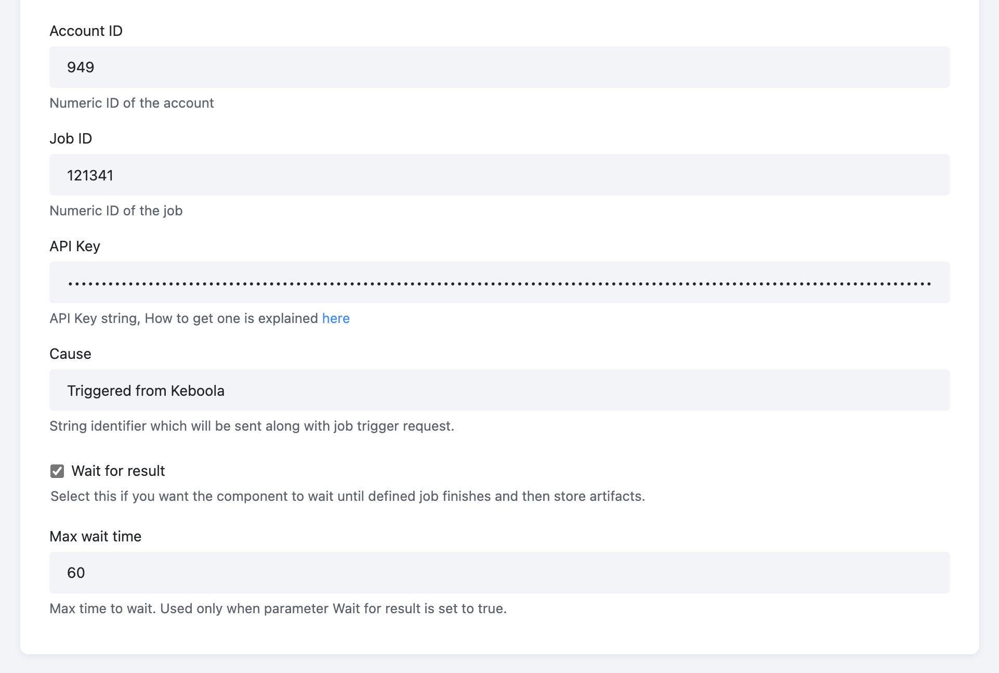
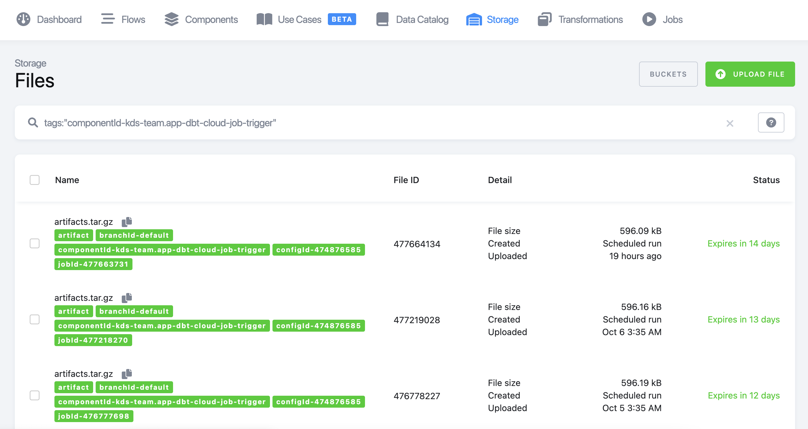
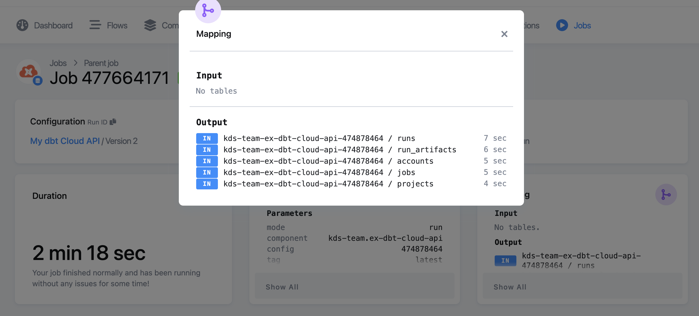

dbt Cloud is supported via dedicated components. Users can find them in “components” menu section:

{: width="100%" }

*   `kds-team.ex-dbt-cloud-api` for extracting data from dbt Cloud API

*   `kds-team.app-dbt-cloud-job-trigger` for triggering dbt Cloud job remotely, and optionally wait for the job results. In that case, component stores artifacts as well

## dbt Cloud Trigger

{: width="100%" }

The component configuration is pretty straightforward, user needs to define `Account ID`, `Job ID` and use `API key` for the authorization.

Component generates status table `dbt_cloud_trigger` storing the job trigger API response:

{: width="100%" }

When “Wait for result” is selected, the component polls the status until the job ends. The component has a default wait time limit that can be optionally set to different time. When the wait for result is used, component extracts artifacts and stores them in the file storage and additionally produces a job result API call table:

{: width="100%" }

Both tables can be found within the storage, or access directly from the job result:

{: width="100%" }

Artifacts can be found in the storage - files - search by tag:

{: width="100%" }

Search by tag (component type or configuration ID):

`tags:"componentId-kds-team.app-dbt-cloud-job-trigger"`

{: width="100%" }

Note: Those files can be also easily [retrieved externally via API](https://keboola.docs.apiary.io/#reference/files/list-files/list-files) or from integrated Jupyter workspace for further analysis.

Tip: please mind base URL of API call, which depends on the stack you are using (US vs. Azure EU vs. EU central)

## dbt Cloud API Extractor

The purpose of this component is to extract and store [dbt Cloud API](https://docs.getdbt.com/dbt-cloud/api-v2) information (data is stored incrementally) for the following endpoints:

*   accounts

*   projects

*   jobs

*   runs

*   run\_artifacts

To configure extractor, enter API token and select default configuration:

{: width="100%" }

Data can be accessed form the storage, or directly from the job detail screen:

{: width="100%" }

Note: Extractor utilizes our powerful Generic extractor. In the case you want to customize the extraction, select just some endpoints etc. you can switch to JSON schema and manually edit the configuration.
