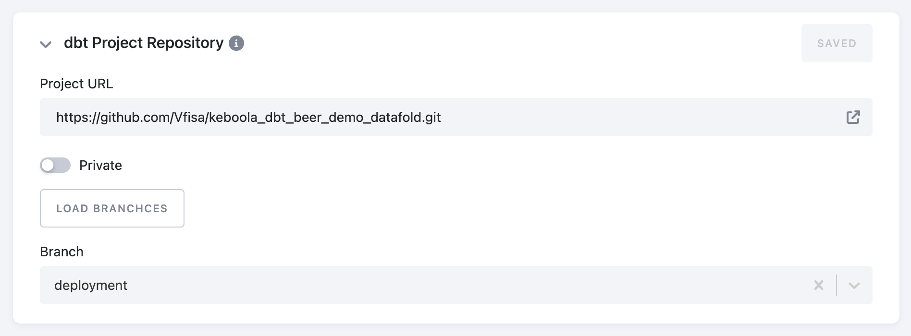
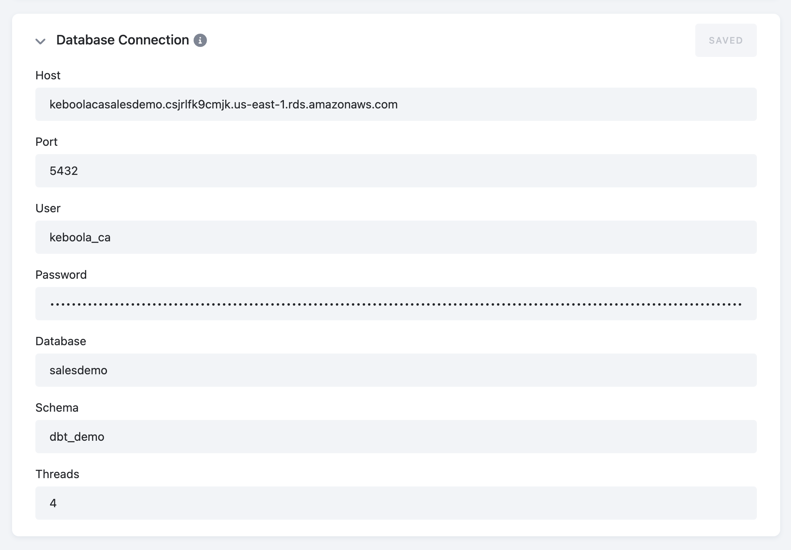
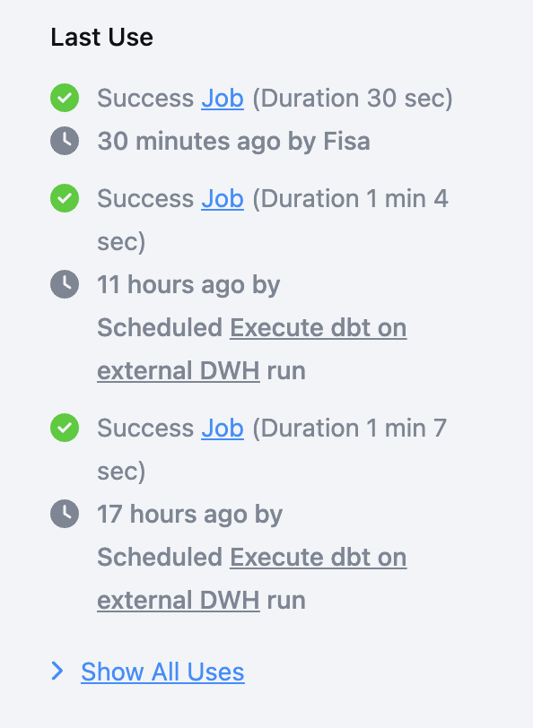

## Configuration

{: width="100%" }

### dbt Project Repository

Users first define a repository by specifying the URL (ending with GIT) and entering the access credentials if required.

{: width="100%" }

After saving a configuration, click on “load branches”, to select desired branch. Do not forget to click save.

{: width="100%" }

### Execution Steps

{: width="100%" }

Check desired execution steps - you can re-arrange the steps as well. If there are others you require and you don’t see as the option, please send as a feature suggestion through the help icon.

### Execution Parameters

Often users define specific [run parameters and node selectors](https://docs.getdbt.com/reference/node-selection/syntax). In a nutshell, it is everything after `--select` . Please refer to official [dbt core documentation](https://docs.getdbt.com/reference/node-selection/syntax).

{: width="100%" }

Users often specify path, tags or specific models.

{: width="100%" }

Note: The default thread level for Keboola dbt transformation is set to 4. You can override this by using `--threads X` parameter in the Execution Parameters.

### Output Mapping (Keboola Storage component only)

This is a specific configuration needed for the Keboola dbt component. Users define which tables end up being imported within storage. This configuration uses a standard output mapping UI elements with configuration options, such as incremental or full load, filters, etc.

{: width="100%" }

### Database Connection (Remote DWH components only)

{: width="100%" }

Configuration parameters expose typical dbt connection configurations, adjusted to the specific adapter settings. To validate connection, run a debug job from the right menu.

Note: You can control threads for the execution as a part of this settings.

## Run debug job

{: width="100%" }

To test if you are using correct credentials and if the overall project is correct, you can run a debug job. This is the same as running `dbt debug` from the command prompt.

Debug button will create a separate job with a standard logging, exposing the results of dbt debug command:

{: width="100%" }

## Manually triggering dbt transformation

When a user runs dbt transformation manually, a new job is being triggered with all standard logging, storing information such as:

*   person (token) triggered job

*   start, end and duration of the job

*   job parameters

*   component execution log

*   dbt deps and repository information

*   full dbt log for all steps defined

*   storage output (Keboola dbt)

*   record of producing and storing artifacts

{: width="100%" }

You can also access all configuration jobs from configuration screen and jobs menu section.

{: width="100%" }
{: width="100%" }

## Discover

The Discover tab is designed to provide more information about the run. Keboola aims to expand the insights on this tab to provide more information to the user. Currently, it provides the timeline designed to visually display the duration of each model build.

{: width="100%" }

## dbt Docs

When a user adds a dbt docs generate execution step, job generates necessary files within artifacts to power documentation. dbt docs are then accessible on the button from the main configuration screen.

{: width="100%" }

The button performs synchronous action to generate docs in the popup:

{: width="100%" }
