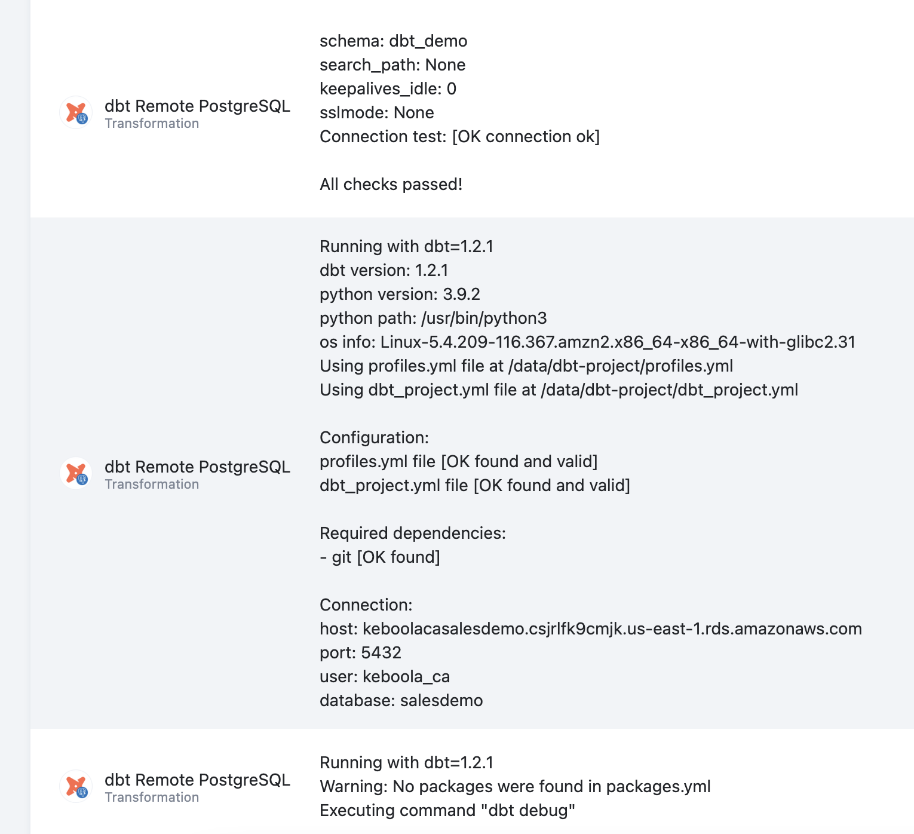
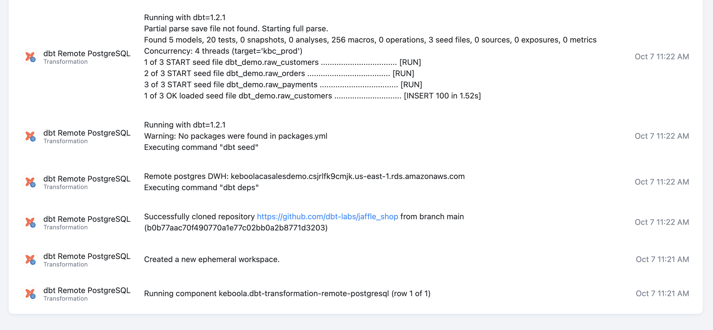
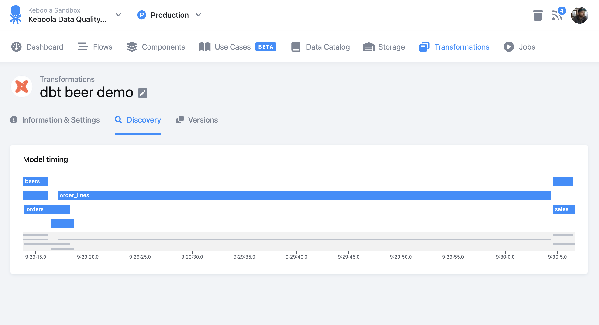
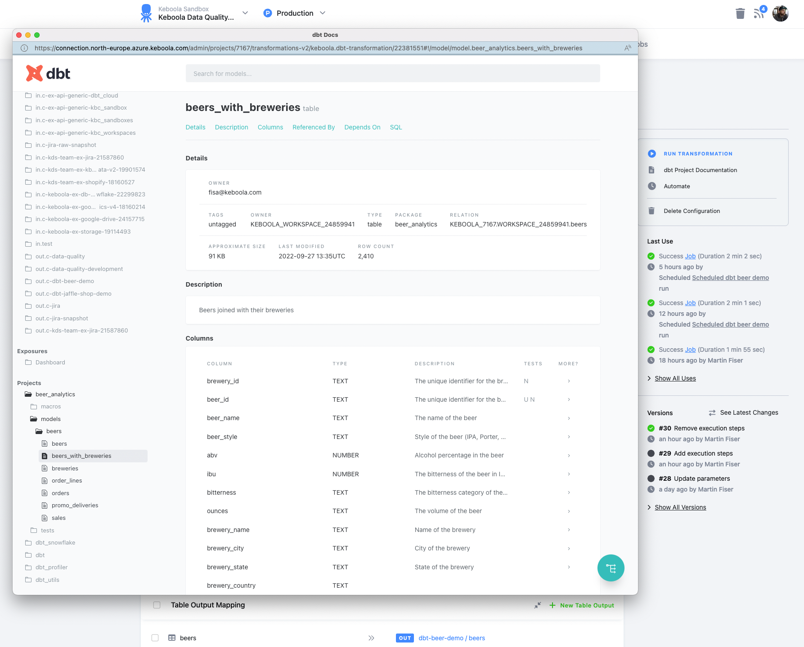

## Configuration

{: width="100%" }

### dbt Project Repository

First, you must define a repository by specifying the URL (ending with GIT) and entering the access credentials if required.

{: width="100%" }

After saving a configuration, click **Load Branches** to select the desired branch. Don't forget to click **Save**.

{: width="100%" }

### Execution Steps

{: width="100%" }

Select the desired execution steps and rearrange them if needed. If you need additional steps that are not available, please send us a feature request via the help icon.

### Execution Parameters

You can define specific [run parameters and node selectors](https://docs.getdbt.com/reference/node-selection/syntax). In short, this refers to everything after `--select`. Please visit the official [dbt core documentation](https://docs.getdbt.com/reference/node-selection/syntax).

{: width="100%" }

You can also specify a path, tags, and specific models.

{: width="100%" }

***Note:** The default thread level for the Keboola dbt transformation is set to 4. You can override this by using the `--threads X` parameter in the **Execution Parameters**.*

### Freshness
If you run the `dbt source freshness` step in your project, you can set time limits for displaying warnings and errors. Both time limits can be enabled and configured independently.
{: width="100%" }

### Artifacts
Artifacts generated by dbt (all steps except `dbt deps` and `dbt debug`) are automatically stored in Keboola Storage. Depending on the configuration, they are saved either as a compressed ZIP file or as individual files.

***Note:** Artifacts are stored only if the job finished successfully.*

### Output Mapping (Keboola Storage Component Only)

This is a specific configuration needed for the Keboola dbt component. Define which tables will be imported within storage. This configuration uses a standard output mapping UI element with configuration options, such as incremental or full load, filters, etc.

{: width="100%" }

### Database Connection (Remote DWH Components Only)

{: width="100%" }

Configuration parameters expose typical dbt connection configurations, adjusted to the specific adapter settings. To validate a connection, run a debug job from the right menu.

***Note:** You can control threads for the execution as part of these settings.*

## Run Debug Job

{: width="50%" }

To verify that your credentials and project setup are correct, you can run a debug job. This is the same as running `dbt debug` from the command prompt.

The **Run Debug** button will create a separate job with standard logging, exposing the results of the dbt debug command:

{: width="100%" }

## Manually Triggering dbt Transformation

When you manually run a dbt transformation, a new job is triggered with standard logging and stores information such as:

*   Person (token) triggered job

*   Start, end, and duration of the job

*   Job parameters

*   Component execution log

*   dbt deps and repository information

*   Full dbt log for all steps defined

*   Storage output (Keboola dbt)

*   Record of producing and storing artifacts


{: width="100%" }

You can also access all configuration jobs from the configuration screen and the **Jobs** menu section.

{: width="100%" }

{: width="50%" }

## Discover

The **Discover** tab is designed to provide more information about the run. Keboola plans to expand this tab to offer additional insights. Currently, it provides the timeline designed to visually display the duration of each model build.

{: width="100%" }

## dbt Docs

When you press **dbt Project Documentation**, the job will generate the necessary files within artifacts to power documentation. The dbt documentation is then accessible via the button from the main configuration screen.

{: width="50%" }

Clicking the button synchronously generates the documentation in a popup:

{: width="100%" }

## Profiles and Target

Keboola automatically generates a `profiles.yml` file for your dbt transformation. Here, you can see what the generated file looks like:
```

default:
  outputs:
    kbc_prod:
      type: '{{ env_var("DBT_KBC_PROD_TYPE") }}'
      user: '{{ env_var("DBT_KBC_PROD_USER") }}'
      password: '{{ env_var("DBT_KBC_PROD_PASSWORD") }}'
      schema: '{{ env_var("DBT_KBC_PROD_SCHEMA") }}'
      warehouse: '{{ env_var("DBT_KBC_PROD_WAREHOUSE") }}'
      database: '{{ env_var("DBT_KBC_PROD_DATABASE") }}'
      account: '{{ env_var("DBT_KBC_PROD_ACCOUNT") }}'
      threads: '{{ env_var("DBT_KBC_PROD_THREADS")| as_number }}'
  target: kbc_prod

```

***Note:** The values of environment variables are provided automatically based on the database connection settings or the use of Keboola Storage.*

If needed, you can use a `profiles.yml` file committed in your dbt project repository for Remote DWH components and set the target according to your requirements. In this case, you must use the environment variables mentioned above in the generated `profiles.yml` and specify the target in each executed step. Your committed `profiles.yml` file will be merged with the automatically generated version.
{: width="100%" }

{: .alert.alert-warning}
Important: Never commit sensitive information such as access credentials or passwords to the repository.
